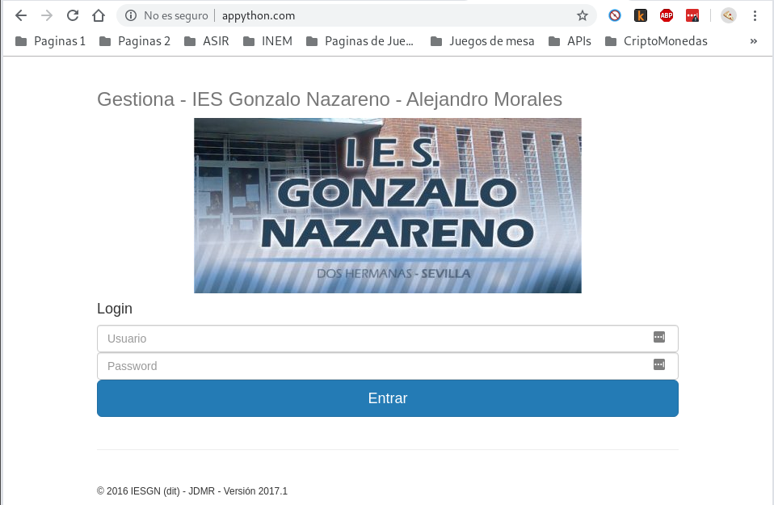

## Tarea 1: Entorno de desarrollo

#### Formas parte del equipo de desarrollo de la aplicación “Gestión IESGN”, aplicación web desarrollada con python, con el framework django. Vamos a configurar tu equipo como entorno de desarrollo para trabajar con la aplicación, para ello

* Realiza un fork del repositorio de GitHub: https://github.com/jd-iesgn/iaw_gestionGN
* Clona el repositorio en tu equipo.

~~~
git clone git@github.com:MoralG/iaw_gestionGN.git
~~~

---------------------------------------------------------------------------------------

* Crea un entorno virtual python3 e instala las dependencias necesarias para que funcione el proyecto (fichero requierements.txt).

~~~
python3 -m venv django2
source django2/bin/activate
pip install -r requirements.txt
~~~

###### Puede que tengamos que instalar las dependencias

~~~
sudo apt install python3-dev
sudo apt-get install libjpeg-dev zlib1g-dev
~~~

---------------------------------------------------------------------------------------

* Comprueba que vamos a trabajar con una base de datos sqlite (gestion\settings.py). ¿Cómo se llama la base de datos que vamos a crear?

###### Nuestra base de datos se va a llamar *djangodb*

~~~
DATABASES = {
    'default': {
        'ENGINE': 'django.db.backends.sqlite3',
        'NAME': os.path.join(BASE_DIR, 'djangodb'),
    }
}
~~~

---------------------------------------------------------------------------------------

* Crea la base de datos: python3 manage.py migrate. A partir del modelo de datos se crean las tablas de la base de datos.

~~~
python3 manage.py migrate
Operations to perform:
  Apply all migrations: admin, auth, centro, contenttypes, convivencia, sessions
Running migrations:
  Applying contenttypes.0001_initial... OK
  Applying auth.0001_initial... OK
  Applying admin.0001_initial... OK
  Applying admin.0002_logentry_remove_auto_add... OK
  Applying contenttypes.0002_remove_content_type_name... OK
  Applying auth.0002_alter_permission_name_max_length... OK
  Applying auth.0003_alter_user_email_max_length... OK
  Applying auth.0004_alter_user_username_opts... OK
  Applying auth.0005_alter_user_last_login_null... OK
  Applying auth.0006_require_contenttypes_0002... OK
  Applying auth.0007_alter_validators_add_error_messages... OK
  Applying auth.0008_alter_user_username_max_length... OK
  Applying centro.0001_initial... OK
  Applying centro.0002_cursos_equipoeducativo... OK
  Applying centro.0003_auto_20161102_1656... OK
  Applying centro.0004_auto_20161102_1721... OK
  Applying centro.0005_auto_20161105_1217... OK
  Applying centro.0006_auto_20161106_1741... OK
  Applying convivencia.0001_initial... OK
  Applying sessions.0001_initial... OK
~~~

---------------------------------------------------------------------------------------

* Añade los datos de prueba a la base de datos. Para más información: https://coderwall.com/p/mvsoyg/django-dumpdata-and-loaddata. Utiliza el fichero datos.json.

~~~
./manage.py loaddata datos.json
   Installed 89 object(s) from 1 fixture(s)
~~~

---------------------------------------------------------------------------------------

* Ejecuta el servidor web de desarrollo y comprueba en el navegador que la aplicación está funcionando.

~~~
python manage.py runserver
~~~

---------------------------------------------------------------------------------------

* Entra en la zona de administración para comprobar que los datos se han añadido correctamente. Usuario: admin contraseña: asdasd1234.

---------------------------------------------------------------------------------------

* Accede con el usuario usuario (contraseña: asdasd1234).

## Tarea 2: Desarrollando nuestra aplicación

#### Vamos a realizar un cambio en la aplicación y comprobar que los cambios se realizan correctamente

* Modifica la página inicial de la aplicación para que aparezca tu nombre.
Sube los cambios al repositorio

~~~
 

        <h3 class="text-muted">Gestiona - IES Gonzalo Nazareno - Alejandro Morales</h3>

      

~~~

---------------------------------------------------------------------------------------

* Muestra una captura de pantalla donde sea la modificación realizada. (1 punto)

## Tarea 3: Entorno de producción

#### Vamos a realizar el despliegue de nuestra aplicación en un entorno de producción, para ello vamos a utilizar una instancia del cloud, para ello:

* Instala en el servidor los servicios necesarios (apache2, mysql, …). Instala el módulo de apache2 para ejecutar código python

~~~
sudo apt install apache2
sudo apt install libapache2-mod-wsgi-py3
sudo apt install mysql-common
~~~

---------------------------------------------------------------------------------------

* Clona tu repositorio en el DocumentRoot de tu virtualhost
  
~~~
sudo apt install git
cd /var/www/html/
sudo git clone https://github.com/MoralG/iaw_gestionGN.git
~~~

---------------------------------------------------------------------------------------

* Crea un entorno virtual e instala las dependencias de tu aplicación.
  
~~~
sudo apt install python3-venv
python3 -m venv django
source django/bin/activate
pip install -r requirements.txt
~~~

---------------------------------------------------------------------------------------

###### Puede que tengamos que instalar las dependencias

~~~
sudo apt install python3 python-dev python3-dev build-essential libssl-dev libffi-dev libxml2-dev libxslt1-dev zlib1g-dev python-pip libjpeg-dev
~~~

---------------------------------------------------------------------------------------

* Instala el módulo que permite que python trabaje con mysql:
  
~~~
sudo apt install python3-mysqldb
~~~

###### Y en el entorno virtual

~~~
pip install mysql-connector-python
~~~

---------------------------------------------------------------------------------------

* Configura un virtualhost en apache2 con la configuración adecuada para que funcione la aplicación. El punto de entrada de nuestro servidor será iaw_gestionGN/gestion/wsgi.py.

###### Creamos un fichero _.conf_ y metemos los siguiente

~~~
<VirtualHost *:80>

        ServerName www.appython.com
        ServerAdmin webmaster@localhost
        DocumentRoot /var/www/html/iaw_gestionGN

        WSGIScriptAlias / /var/www/html/iaw_gestionGN/gestion/wsgi.py

        WSGIDaemonProcess django user=www-data group=www-data processes=5 python-path=/var/www/html/iaw_gestionGN:/home/debian/django/lib64/python3.7/site-packages

        Alias "/static/" "/var/www/html/iaw_gestionGN/static/"
        	<Directory /var/www/html/iaw_gestionGN/static/>
        		Options +FollowSymLinks
        		Require all granted
        	</Directory>

        <Directory /var/www/html/iaw_gestionGN>
                WSGIProcessGroup django
                WSGIApplicationGroup %{GLOBAL}
                Require all granted
        </Directory>

        ErrorLog ${APACHE_LOG_DIR}/error.log
        CustomLog ${APACHE_LOG_DIR}/access.log combined

</VirtualHost>
~~~

###### Cambiamos el propietario del fichero _iaw_gestion_

~~~
sudo chown -R www-data:www-data /var/www/html/iaw_gestionGN
~~~

###### Creamos el enlace simbólico

~~~
sudo a2ensite appython
~~~

###### Tenemos que poner nuestra NameServer en el fichero _/var/www/html/iaw_gestionGN/gestion/settings.py_

~~~
ALLOWED_HOSTS = ['www.appython.com']
~~~

###### Puede que tengamos que activar el módulo wsgi

~~~
sudo a2enmod wsgi
~~~

###### Reiniciamos el servicio

~~~
sudo systemctl restart apache2.service
~~~

---------------------------------------------------------------------------------------

* Crea una base de datos y un usuario en mysql.

~~~
sudo apt install mariadb-server
~~~

~~~
sudo mysql -u root

CREATE USER 'python'@'%' IDENTIFIED BY 'python';
create database pythondb;
grant all on pythondb.* to python@localhost identified by 'python';
~~~

---------------------------------------------------------------------------------------

* Configura la aplicación para trabajar con mysql, para ello modifica la configuración de la base de datos en el archivo settings.py:
  
~~~
DATABASES = {
    'default': {
        'ENGINE': 'mysql.connector.django',
        'NAME': 'pythondb',
        'USER': 'python',
        'PASSWORD': 'python',
        'HOST': 'localhost',
        'PORT': '',
    }
}
~~~

---------------------------------------------------------------------------------------

* Crea las tablas de la base de datos y carga los datos de pruebas. Accede a mysql y comprueba que se han creado de forma adecuada.

###### Ahora vamos a añadir las tablas a la base de datos asignada en mysql

~~~
python3 manage.py migrate
  Operations to perform:
    Apply all migrations: admin, auth, centro, contenttypes, convivencia, sessions
  Running migrations:
    Applying contenttypes.0001_initial... OK
    Applying auth.0001_initial... OK
    Applying admin.0001_initial... OK
    Applying admin.0002_logentry_remove_auto_add... OK
    Applying admin.0003_logentry_add_action_flag_choices... OK
    Applying contenttypes.0002_remove_content_type_name... OK
    Applying auth.0002_alter_permission_name_max_length... OK
    Applying auth.0003_alter_user_email_max_length... OK
    Applying auth.0004_alter_user_username_opts... OK
    Applying auth.0005_alter_user_last_login_null... OK
    Applying auth.0006_require_contenttypes_0002... OK
    Applying auth.0007_alter_validators_add_error_messages... OK
    Applying auth.0008_alter_user_username_max_length... OK
    Applying auth.0009_alter_user_last_name_max_length... OK
    Applying auth.0010_alter_group_name_max_length... OK
    Applying auth.0011_update_proxy_permissions... OK
    Applying centro.0001_initial... OK
    Applying centro.0002_cursos_equipoeducativo... OK
    Applying centro.0003_auto_20161102_1656... OK
    Applying centro.0004_auto_20161102_1721... OK
    Applying centro.0005_auto_20161105_1217... OK
    Applying centro.0006_auto_20161106_1741... OK
    Applying convivencia.0001_initial... OK
    Applying sessions.0001_initial... OK
~~~

###### Rellenamos las tablas creadas con el siguiente comando

~~~
./manage.py loaddata datos.json
  Installed 89 object(s) from 1 fixture(s)
~~~

###### Comprobamos que se han creado las tablas

~~~
MariaDB [pythondb]> show tables;
+---------------------------------+
| Tables_in_pythondb              |
+---------------------------------+
| auth_group                      |
| auth_group_permissions          |
| auth_permission                 |
| auth_user                       |
| auth_user_groups                |
| auth_user_user_permissions      |
| centro_alumnos                  |
| centro_areas                    |
| centro_areas_Departamentos      |
| centro_cursos                   |
| centro_cursos_EquipoEducativo   |
| centro_departamentos            |
| centro_profesores               |
| convivencia_amonestaciones      |
| convivencia_sanciones           |
| convivencia_tiposamonestaciones |
| django_admin_log                |
| django_content_type             |
| django_migrations               |
| django_session                  |
+---------------------------------+
20 rows in set (0.001 sec)
~~~

---------------------------------------------------------------------------------------

* Desactiva en la configuración (fichero settings.py) el modo debug a False. Para que los errores de ejecución no den información sensible de la aplicación.

###### Vamos a editar la linea _DEBUG_ del fichero _settings.py_

~~~
DEBUG = False
~~~

---------------------------------------------------------------------------------------

* Muestra la página funcionando.

###### Comprobación

## Tarea 4: Modificación de la aplicación en el entorno de producción

#### Vamos a realizar cambios en el entorno de desarrollo y posteriormente vamos a subirlas a producción.

* Modifica la página inicial para que muestre otra imagen. Despliega los cambios en el servidor de producción

###### Editamos el fichero *index.html* y le añadimos la imagen que queramos

~~~
cat templates/index.html





~~~

###### Comprobación

---------------------------------------------------------------------------------------

* Vamos a crear una nueva tabla en la base de datos, para ello sigue los siguientes pasos:

1. Añade un nuevo modelo al fichero centro/models.py:
~~~
class Modulos(models.Model):
    Abr = models.CharField(max_length=4)
    Nombre = models.CharField(max_length=50)
    Unidad = models.ForeignKey(Cursos,blank=True,null=True,on_delete=models.SET_NULL)
    def __unicode__(self):
        return self.Abr+" - "+self.Nombre
    class Meta:
        verbose_name="Modulo"
        verbose_name_plural="Modulos"
~~~
2. Crea una nueva migración: python3 manage.py makemigrations.

~~~
python3 manage.py makemigrations
   Migrations for 'centro':
     centro/migrations/0007_modulos.py
       - Create model Modulos
~~~

3. Y realiza la migración: python3 manage.py migrate

~~~
python3 manage.py migrate
   Operations to perform:
     Apply all migrations: admin, auth, centro, contenttypes, convivencia, sessions
   Running migrations:
     Applying centro.0007_modulos... OK
~~~

4. Añade el nuevo modelo al sitio de administración de django:

Para ello cambia la siguiente línea en el fichero centro/admin.py:
~~~
from centro.models import Cursos,Alumnos,Departamentos,Profesores,Areas
~~~

Por esta otra:
~~~
from centro.models import Cursos,Alumnos,Departamentos,Profesores,Areas,Modulos
~~~

Y añade al final la siguiente línea:
~~~
admin.site.register(Modulos)
~~~

###### Comprobación

* Despliega el cambio producido al crear la nueva tabla en el entorno de producción.

###### Entorno de desarrollo

~~~
git add static/img/AlejandroAvatar.png
git add centro
git add djangodb djangodb
git commit -am "Modificación"
git push
~~~

###### Entorno de producción

~~~
sudo git pull
   remote: Enumerating objects: 15, done.
   remote: Counting objects: 100% (15/15), done.
   remote: Compressing objects: 100% (8/8), done.
   remote: Total 15 (delta 7), reused 12 (delta 7), pack-reused 0
   Unpacking objects: 100% (15/15), done.
   From https://github.com/MoralG/iaw_gestionGN
      2fe904d..5a1351a  master     -> origin/master
   Updating 2fe904d..5a1351a
   Fast-forward
    centro/admin.py                |   3 ++-
    centro/models.py               |  17 ++++++++++++-----
    gestion/settings.py            |   2 +-
    static/img/AlejandroAvatar.png | Bin 0 -> 32122 bytes
    templates/base.html            |   2 +-
    templates/index.html           |   4 ++--
    6 files changed, 18 insertions(+), 10 deletions(-)
    create mode 100644 static/img/AlejandroAvatar.png
~~~

###### Para que el *css* de la zona de administrador se veo correctamente tenemos que ejecutar el siguiente comando, que hace que recoge el los static que no estan en el directorio de nuestra página

~~~
sudo python3 manage.py collectstatic
   You have requested to collect static files at the destination
   location as specified in your settings.
   
   This will overwrite existing files!
   Are you sure you want to do this?
   
   Type 'yes' to continue, or 'no' to cancel: yes
~~~

